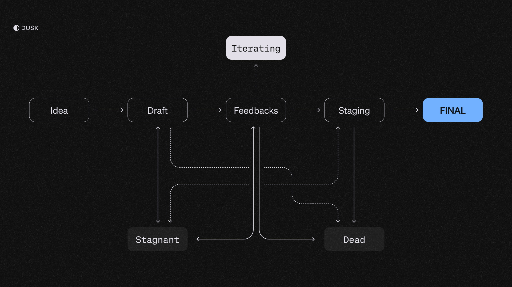

## What is a DIP?

A <a href="https://github.com/dusk-network/dips" target="_blank">Dusk Improvement Proposal (DIP)</a> is a formal document that proposes a new feature, standard, or protocol adjustment within Dusk. DIPs are the primary mechanism for proposing new features, collecting community input on an issue, and documenting the design decisions that have gone into the Dusk protocol architecture. They are meant to be the source of truth for Dusk protocol improvements, serving both as a historical document and a detailed explanation of the feature and its purpose.

A DIP may be required to enable specific use-cases, as the Dusk protocol encompasses all rules that nodes must follow in order to:
- Achieve consensus
- Achieve synchronism
- Create, validate, and process transactions

## Purpose

The DIP repository is intended to provide a structured process for making substantive changes to the Dusk protocol. Its goals are to:

- Ensure that proposed improvements are thoroughly discussed and evaluated
- Create a transparent and inclusive process for governance
- Facilitate the collection and documentation of a coherent and comprehensive history of governance and feature proposals
- Encourage active community participation and collaboration

## How to Propose a DIP

1. **Familiarize Yourself with Existing DIPs**: Before drafting a new proposal, please review the existing DIPs to ensure your idea is unique and not already covered.
2. **Draft Your Proposal**: Following the [DIP Template](https://github.com/dusk-network/dips/issues/1) specification, the [template structure for a DIP follows](#dip-structure). Your DIP should provide a concise specification of the feature and a rationale for the feature.
3. **Submit Your DIP**: Fork the repository, add your DIP draft to the `dips` directory using the naming convention `dip-<number>.md`, where `<number>` is your proposed DIP number in four figures (e.g. dip-0001). Then, submit a PR against the main branch of the Dusk DIPs repository.
4. **Discussion and Review**: The DIP will undergo a review and discussion phase where the community and DIP editors will provide feedback. Be prepared to revise your draft in response to feedback.
5. **Finalization**: Once accepted, the DIP editors will assign a DIP number, merge your PR, and track the progress of the DIP implementation.

### DIP Structure

Each Dusk Improvement Proposal (DIP) must adhere to the following structure so as to ensure clarity and consistency across proposals.

1. **Preamble**:
    - **DIP Number:** (To be assigned upon acceptance)
    - **Title**
    - **Author(s):** Contact information and GitHub usernames
    - **Status:** (Draft, Review, Accepted, Final, Rejected)
    - **Category/Type:** (Core, Standards, Governance, etc.)
    - **Creation Date**

2. **Abstract**: A concise technical summary of the proposal.
3. **Motivation**: Describes the issue being addressed and why the proposal is necessary.
4. **Technical Specification**: Detailed description of the proposed changes, including protocol changes, data structures, API alterations, and cryptographic considerations.
5. **Rationale**: Discussion on the decision-making process and trade-offs considered.
6. **Backwards Compatibility**: Analysis of how the proposal interacts with existing features or might affect backward compatibility.
7. **Test Cases**: Practical examples and test cases for validating the proposed changes.
8. **Implementation**: Reference to the implementation code; this may include links to PRs in external repositories.
9. **Security Considerations**: Assessment of potential security implications and how they are addressed.
10. **References**: Links to any related documents, discussions, or other relevant materials.
11. **Updates (Optional)**: Documenting significant changes or updates to the proposal post-acceptance.

## DIP Workflow

The Dusk Improvement Proposal (DIP) process is designed to provide a transparent and structured approach to proposing improvements within the Dusk protocol. Each DIP follows a clear path from inception to finalization:

1. **Idea:** The process begins with an initial concept or idea. The write-up is unstructured, and the idea is introduced as a proposal with a title that goes as `Proposal: [Title]`. There is no DIP number assigned yet.
2. **Draft:** Once the idea has been sufficiently fleshed out, a formal draft is created to detail the proposal. A DIP number is assigned, a structure is created, and the draft undergoes review and feedback.
3. **Feedback:** The DIP offers a first deliverable in a prototypical form (a technical implementation, a paper, etc). Feedback is collected in order to improve the DIP.
4. **Staging:** After the review, the proposal enters the `Staging` phase, indicating it is nearing completion and providing a final chance for feedback. If the DIP relates to technical implementation, it is staged on our testnet, `Nocturne`.
5. **Active:** If the DIP receives consensus, it is marked as Active and its deliverables are incorporated into the production environment (Mainnet for code, `docs.dusk.network` for documentation, etc).

Additionally, proposals can be transitioned to a **Stagnant** state if they are not actively being developed. A proposal might also become **Dead** either by the author(s) or if it stays in `Stagnant` status for more than 6 months.

Below is a diagram that illustrates the DIP workflow:

## Further information

For further information or to submit a DIP, you can have a look at the <a href="https://github.com/dusk-network/rusk" target="_blank">DIPs repository</a>.
