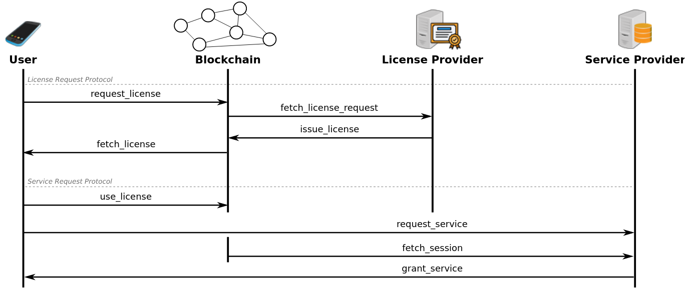

In a digitized world of today, in which different parties are massively interacting with each other exchanging huge amounts of personal and sensitive information, it is extremely important that those participants have full control over the information they expose and share. For this reason, the term Self-Sovereign Identity (SSI) began to be used to describe systems where their users are able to manage their identities in a fully transparent and private manner. This means that, at any moment, every user knows which information about them is being shared while using their identity.

Citadel is a zero-knowledge-proofs-based SSI management system where users' identities are stored in a trusted and private manner using a decentralized network. In our particular case, using the Dusk Blockchain. 

There are three different parties involved in our protocol:

- **User:** A party willing to get a license that will allow them to use particular services. They request licenses on-chain to license providers, and after receiving those licenses, they are able to use the licenses on-chain, in order to establish private off-chain connections with service providers.
- **License Provider (LP):** A party receiving on-chain requests from users. They can accept the requests and issue the licenses on-chain, which will be addressed to the users requesting them.
- **Service Provider (SP):** A party receiving off-chain requests from users to grant services, and whose requests can be verified by means of information stored on-chain.

## How does Citadel Work?

Citadel is composed of two main protocols: the *license request protocol*, and the *service request protocol*. An overview of these protocols is as follows.

- **License Request Protocol:** this is the process where a user requests a license to the LP, by means of the following steps:
    - **(user) request_license**: it sends a transaction on-chain, including a precomputed stealth address where the license will be received.
  - **(LP) fetch_license_request**: the LP is continuously scanning the Blockchain for incoming requests addressed to them.
  - **(LP) issue_license**: the LP, upon verification of the request, issues a license on-chain into a transaction, using the stealth address included in the request.
  - **(user) fetch_license**: the user scans the Blockchain for incoming licenses.

- **Service Request Protocol:** this is the process where a user requests a service to the SP, by means of the following steps:
    - **(user) use_license**: it sends a transaction on-chain, including a zero-knowledge proof that proves that the user owns a valid license. In this process, a session for an specific service is opened, and a session cookie is computed: a value needed to verify that a license was correctly used, and thus, it should be shared only with the desired SP.
  - **(user) request_service**: the user requests the service by sending the session cookie to the SP, using a secure channel (e.g. an HTTPS connection).
  - **(SP) fetch_session**: the SP, upon receiving a session cookie, scans the network for a session with the same ID that the session cookie has.
  - **(SP) grant service**: the SP verifies locally the session cookie using the fetched session from the Blockchain, and grants access to the service or denies it based on the output of the verification.
  
The above steps are depicted in detail in the figure that follows.

You can find a more detailed description in the [specs](https://github.com/dusk-network/citadel/blob/main/docs/specs.pdf).

## The License Contract

Citadel is possible thanks to the *license contract* deployed in the Dusk blockchain. The following diagram illustrates how concrete messages are passing between protocol actors, from an implementation point of view.

## Using Citadel

Dusk brings **Moat**, the Citadel SDK. It includes a command line interface tool, as well as an Application Programming Interface (API), which allows users of Dusk to use the built-in Citadel mechanism. You can learn more in the specific [Moat docs](/developer/digital-identity/sdk) .

import { LinkCard, CardGrid } from '@astrojs/starlight/components';

<CardGrid>
     <LinkCard title="Citadel SDK" icon="add-document" href="/getting-started/digital-identity/sdk" description="Documentation on how to use Moat, the Citadel SDK."/>
    <LinkCard title="Specification" icon="pencil" href="https://github.com/dusk-network/citadel/blob/main/docs/specs.pdf" description="Citadel specification document."/>
    <LinkCard title="Original Paper" icon="pencil" href="https://arxiv.org/pdf/2301.09378.pdf" description="Original research paper describing the idea behind Citadel."/>
</CardGrid>
