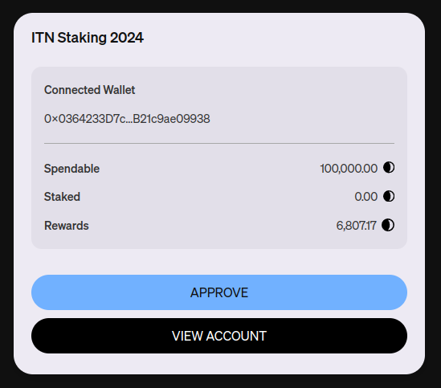
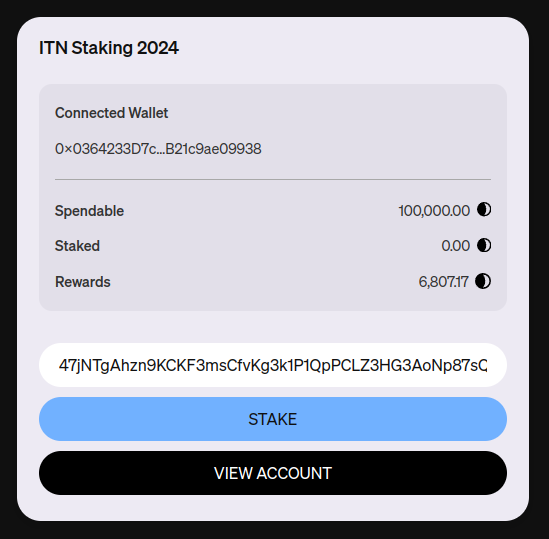

# Quick guide on how to stake DUSK
## Step 1 - Connect
Click on the `Connect Wallet` button. 

## Step 2 - Select
Select your wallet of choice and accept the request to connect the wallet.

## Step 3 - Approve
Click on the `Approve` button to approve that the contract can use your ERC20 DUSK.

Your wallet will ask you to sign the transaction. Triple check you're doing this for the right staking contract!

## Step 4 - Stake
After the approval transaction has gone through, click on the `Stake` button to stake your DUSK. Optionally, if you also want to receive the equivalent amount of your stake on ITN2, provide a DUSK address in the input field. You can create a DUSK address through our [web wallet](https://wallet.dusk.network/).

Your wallet will ask you to sign the transaction. Triple check you're doing this for the right staking contract!

## Step 5 - Earn
Once the staking transaction has been accepted, the `Staked` amount shown on the staking page should be equal to the amount you transferred.

Starting February 1st, you should see rewards being accrued.

## Step 6 - Unstake
You can retrieve your DUSK at any time by clicking on `Unstake`.

# Frequently Asked Questions (FAQ)
**Q: Can I withdraw my stake at any time?**
Yes! You can withdraw your stake at any time

**Q: How do I receive rewards?**  
While you are staking you accrue rewards at a rate proportional to your stake. You can unstake and restake as you wish, but rewards only accrue while your DUSK is staked. Rewards are not lost by unstaking.

**Q: When will I get my rewards?**
The rewards will be given to you when you bridge from Ethereum to our mainnet with the same address you staked with. Did you earn a 1000 DUSK during the staking period? Then you'll receive a 1000 DUSK extra when you bridge to mainnet.

**Q: How much are the gas fees?** 
It depends on how busy the Ethereum network is. There's 3 operations for staking: Approval, Stake and Unstake. Combined, these use about 300000 gas. You can calculate the cost based on current gas prices by filling in the gas in the `Custom Gas Limit` box: https://etherscan.io/gastracker

**Q: How do I get the DUSK I stake mirrored on ITN as TDUSK?**
If you stake between February 1st and February 14th, do not unstake, and provide an optional Dusk address created through the [web wallet](https://wallet.dusk.network/), you will receive the staked amount in TDUSK.

**Q: Can I add to my existing stake?**
No, you will have to unstake and stake again.
