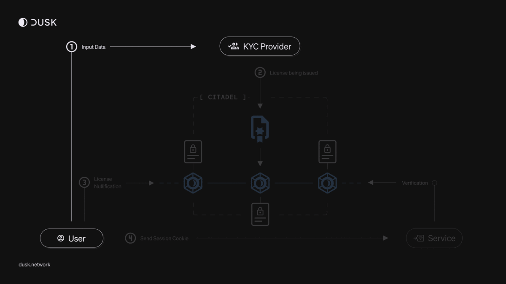
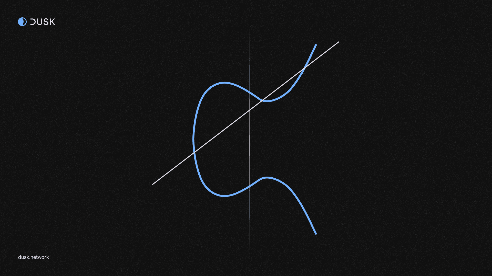

There are a lot of moving pieces within Dusk, and a lot of tools that we have developed in-house to meet the requirements of being private, compliant, and able to interact with regulated assets.

What sets Dusk apart from other blockchains is its bespoke and tailor-made components to ensure compliance, privacy, and the security of the network for the tokenization of Real-World Assets.

## Our PoS Consensus Algorithm

### Succinct Attestation (SA)

Succinct Attestation (SA) is the unique **proof-of-stake** (PoS) consensus algorithm at the core of Dusk. Unlike traditional consensus mechanisms, SA uses a committee-based approach, where eligible participants who hold a predefined amount of DUSK are allowed to partake in the process. The protocol operates in rounds, each generating a new block via a series of validation phases. These phases involve the creation of a candidate block, two rounds of voting on its validity by selected committees, and an agreement phase where the block is accepted if it garners enough votes.

 
## Piecrust

Replacing the former RuskVM, [Piecrust](https://dusk.network/news/piecrust-and-our-transition-to-rust/) is a hyper optimized [virtual machine](https://en.wikipedia.org/wiki/Virtual_machine) built around Wasmer, a WASM runtime. It is a ZK-friendly virtual machine, enabling the development and execution of privacy-focused smart contracts and applications. 

Piecrust is fundamentally different from many blockchain VMs in that it not only executes WASM and is able to natively support ZK operations like SNARK verifications, but it also has a completely different way in which it handles memory.

 
## Phoenix & Moonlight

[Phoenix](tx-models#phoenix) & [Moonlight](tx-models#moonlight) are both transaction models supported by Dusk. One is for privacy, the other one for transparency and compliance.
  
## Kadcast

Kadcast is an innovative peer-to-peer protocol used by Dusk to optimize message exchanges between nodes. Unlike the traditional Gossip protocols used by many blockchain protocols, which broadcasts messages to a random set of nodes, Kadcast uses a structured overlay to direct message flow. This massively reduces network bandwidth and makes latency much more predictable, and at the same time lower compared to Gossip protocols.
 
## Rusk

Rusk can be thought of as the technological heart of the Dusk network, similar to the motherboard of a computer. It is defined as the smart contract platform, but it actually services multiple critical functions. Rusk includes foundational elements like the genesis ZK circuits and contracts, such as the transfer and stake contracts. It integrates key components such as Plonk, Kadcast and Piecrust, and supplies host functions to the Piecrust VM. Beyond that, Rusk houses the consensus mechanism and node software, maintaining the chain state, database and network. It also provides crucial external APIs.
 
## Application layer

At the application layer of our network, we’ve introduced innovative protocols and a transaction model designed to seamlessly meet the needs of financial institutions looking to tokenize Real-World Assets. Let’s take a closer look at the Genesis contracts, Citadel and Zedger/XSC.

### Genesis Contracts

Dusk contains two fundamental Genesis contracts, which are contracts that are available when the network starts, known as the **stake** and **transfer** contracts. 

The stake contract is responsible for managing the stakes associated with node provisioners (stakers). It tracks which provisioners are currently staking, records their rewards and enables the functionality to stake, unstake and withdraw rewards.

### Transactions on Dusk

Transactions in Dusk are managed by the <a href="https://github.com/dusk-network/rusk/tree/master/contracts/transfer" target="_blank">Transfer Contract</a>. The transfer contract oversees the handling of both transparent and obfuscated transactions within the network. It maintains a Merkle tree of notes to ensure integrity. The transfer contract also has the ability to combine notes, preventing the tree from becoming excessively large and hindering network performance. Through the transfer contract, inter-contract calls can be made.

Additionally, the transfer Contract supports **both** a [UTXO](tx-models#utxos) and [account-based](tx-models#account-model) model through [Phoenix](tx-models#phoenix) and [Moonlight](tx-models#moonlight) to handle transfers of the native currency, gas payments, and serve as a contract execution entry point.

### Citadel

[Citadel](https://press.dusk.network/222353-dusk-network-presents-citadel-zero-knowledge-kyc-solution) is a groundbreaking Self-Sovereign Identity (SSI)/Digital Identity (DI) protocol designed for authenticating with third party services while upholding user privacy. With Citadel it’s possible to anonymously prove identity information, like meeting a certain age threshold or living in a certain jurisdiction, without revealing the exact information or revealing more information than is necessary. Given that Citadel is part of the network, it has wide ranging applications for on-chain activity and realizing compliance paving the way to RegDeFi.

### Zedger & XSC

Zedger is an asset protocol that incorporates a unique hybrid transaction model combining the benefits of both UTXO and account-based transaction models. This model provides the Confidential Security Contract (XSC) functionality necessary for Dusk’s securities-related use-cases among them the full lifecycle management of securities and supporting full regulatory compliance.

Zedger allows for the digital representation, native issuance and management of securites in a privacy-preserving manner. Issuers of securities are able to issue, manage, and let investors trade securities as XSC tokens It offers built-in support for compliant settlement, redemption of securities, preventing pre-approved users from having more than one account, supports dividend distribution and voting, and can handle capped transfers. Zedger aims to support a range of security types, like stocks, bonds and ETFs. The emphasis on regulatory compliance and privacy ensures that all operations meet the highest standards required by financial authorities and stakeholders.

[Deep dive into Zedger](deep-dive/transaction_models/zedger) 

## Cryptographic primitives

At the foundation of Dusk’s architecture are the cryptographic primitives - BLS12_381, JubJub, Schnorr and Poseidon. These cryptography tools provide the robust security and privacy features of the network.

### BLS12_381

BLS12_381 is a pairing-friendly elliptic curve used within Dusk to enable aggregation of signatures, which significantly reduces the amount of data to be stored and transmitted over the network, improving overall efficiency of the blockchain. This curve is especially crucial in the context of zero-knowledge proofs, where it provides the backbone for secure and private transactions.

### JubJub

JubJub is another elliptic curve, specifically designed for fast and secure implementation of zero-knowledge proofs. This curve is utilized within Dusk for the construction of efficient zk-SNARKs, allowing transactions and contracts to maintain privacy and integrity without the need to reveal underlying data.

### Schnorr Signatures

Schnorr signatures are a type of digital signature scheme. They offer resistance against forgery. In Dusk, Schnorr signatures contribute significantly to securing user transactions and smart contract interactions. They ensure that only valid transactions are processed and added to the blockchain.

### Poseidon

Poseidon is a cryptographic hash function specifically designed for use in zero-knowledge circuits. It is optimized for performance, security and data integrity within Dusk. By producing a unique hash value for every distinct input, it forms the heart of Dusk’s data structures, making it virtually impossible to alter transaction data once it’s included in the blockchain.

### Dusk-Merkle

Dusk also includes a custom, sparse Merkle tree implementation that is hash-function agnostic. Merkle trees are a fundamental part of many blockchains, enabling efficient and secure verification of large data structures. The Dusk Merkle tree is designed for flexibility and performance, given it’s used in multiple locations like the stake and transfer contract, and Citadel. 
 
### PLONK

PLONK is a versatile proof system developed to facilitate the implementation of zero-knowledge proofs. It forms the core of Dusk’s proof system, allowing efficient and private transactions on the network that are both small in proof size and fast to verify. 

With PLONK, developers can define custom and reusable circuits that can be integrated into Dusk based smart contracts. 
