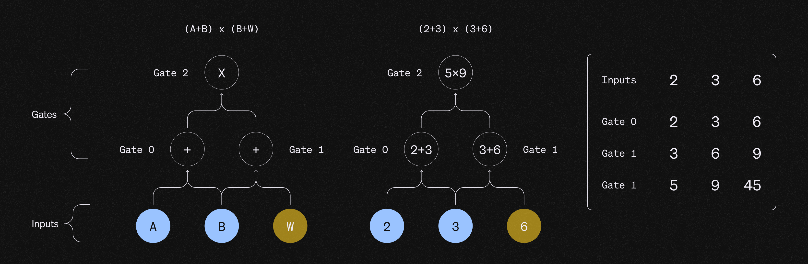

<a href="https://eprint.iacr.org/2019/953.pdf" target="_blank">PLONK</a> is a polynomial Interactive Oracle Proof (IOP) where a Prover can convince a Verifier that for a public circuit `C` and statement `x`, he has a witness `w` such that `C(x,w) = 0`.

This means that the PLONK IOP can be used together with a Polynomial Commitment Scheme (PCS) to construct a universal SNARK for general circuits.

The PLONK pre-processing does not require a trusted setup. This means that depending on which PCS is combined with PLONK, there will be different properties and cryptographic assumptions (that depend on the selected PCS).

For example:
- If the PLONK IOP is combined with a PCS that does not require a trusted setup, then the final SNARK doesn’t have a trusted setup.
- If the PLONK IOP is combined with a PCS that does require a trusted setup, then the final SNARK will need a trusted setup.

The first Rust implementation of PLONK was built by Dusk, and can be found <a href="https://github.com/dusk-network/plonk" target="_blank">here</a>.

## Arithmetization

To efficiently construct proofs, the computation to be proven needs to be transformed into polynomials via an arithmetization. This implies encoding the entire execution trace of the circuit into a table that lists the inputs and output of every gate.

As zk-SNARKs deal with polynomial commitments, a necessary step is interpolating a polynomial that encodes the entire computation trace that needs to be proven. This implies that all the inputs and all the wires need to be encoded into polynomials. The prover uses **Fast Fourier Transformations** (FFTs) to compute the coefficients of the polynomial, making the degree of the polynomial proportional to the number of gates that the computation requires for its arithmetization. For example, if the encoding gives 12 constraints, the correspondent polynomial has a degree at most 11. The fact that the degrees of the polynomials are equal to the number of the elements of the vector minus one is what makes PLONK so efficient.

## Lagrange Polynomials and interpolations

There are two different ways of representing a polynomial:

- **Coefficient representation** (the polynomial is defined by providing its coefficients).
- **Point-value representation** (the polynomial is defined by providing the evaluation of the polynomials at some points).

FFTs and NTTs allow switching between these two different representations, so that it is possible to go back and forth between these representations via a linear transformation.

As any arithmetic circuit described via vectors can be transformed into a Lagrange-base representation, it is useful to represent the vectors as a linear sum of Lagrange polynomials.

The reason is that when using Lagrange interpolation the global parameters are the Lagrange coefficients of the polynomial. This propriety gives an efficient point-value representation for the polynomial.
../
Lagrange polynomials allow to represent vectors via polynomials while making sure that any relation that applies to the vectors also holds true on the polynomials. This implies that because it is possible to evaluate gates using vectors, Lagrange polynomials can be used to represent those vectors as polynomials.

By using Lagrange polynomials, it is already known that their value is going to be either 1 or 0 on a specific set of points. This means that once these specific polynomials are multiplied by a vector, the result is a polynomial that when evaluated at each of those specific points will be equal to an element of the vector.

A consequence of this is that the vector arithmetic can be mapped directly into the equivalent polynomial evaluation, allowing to evaluate a large number of arithmetic gates at once. This allow for efficiency and succintness.

### Roots of Unity and Vanishing Polynomial

The roots of unity in the realm that in the real numbers are 1 and -1, because 1²=1 and -1²=1.

Anyways, because SNARKs work on prime fields, modular arithmetic needs to be used.

To be more specific, the special points in which the Lagrange polynomials evaluate to either 1 or 0 are determined by defining a multiplicative subgroup that acts as the root of unity. In order to construct a proof of knowledge we need to have a very large amount of roots of unity , and the evaluations are verified if they are equal to 0 modulo the vanishing polynomial.

If the arithmetic expression that need to be checked on the vectors holds true, the polynomials that are being evaluated are perfectly divisible for the vanishing polynomial. This implies that instead of evaluating vectors with millions of elements individually, we can simplify the process by evaluating millions of smaller equations with a single equation. This is achieved by verifying if the polynomials are zero modulo the vanishing polynomial of the root of unity.

## Proof Verification

Once the prover encodes the computation trace into polynomials, the verifier needs to verify that the polynomial is a commitment to a valid computation trace by verifying the inputs, gates, copy constraints and outputs.

##### 1) Verify the inputs
The Verifier needs to check if the polynomial that the Prover committed to correctly encodes the inputs of the circuit. To check that the polynomial encodes the correct inputs, the Prover performs a zero test on the vanishing polynomial.

##### 2) Verify the gates evaluations
The Verifier needs to check that each gate operation is evaluated correctly, which implies making sure that addition gates are processed as additions and multiplication gates are processed as multiplications. For example, if a gate represents a sum, the Verifier needs to check that the sum has been correctly performed.

The Verifier can do this by using a Selector polynomial which has been computed at the pre-processing phase and only depends on the gates of the circuit (and not on the inputs). The Selector polynomial evaluates to either 0 or 1 depending on if the gate is an addition gate or multiplication gate. By using the Selector polynomial, we can combine the addition and multiplication equations into one single equation where the Selector can activate or deactivate the multiplication or addition gates (depending on if its value is 0 or 1). The Selector polynomial improves the efficiency of our SNARK, and we can perform the verification with another zero test.

##### 3) Verify the copy constraints
Once we have verified that the single gates operations have been performed correctly, we need to verify that the relationships between these gates are correct. In the previous step we have just verified a bunch of isolated gates: we still did not describe any meaningful circuit, as we didn’t connect any wire. To obtain a SNARK we need to wire the gates and make sure that the output of a gate is the input of another, and verify all these equalities. In other words, for every gate we need to make sure that its output value is “copied” into the input of the correspondent gate. Checking the relationships between all the gates is a tricky part for the construction of a universal SNARK.

Enforcing these Copy Constraints is a complex operation, and the solution that PLONK provides is the reason why it became a such a successful universal SNARK construction.

To check the copy constraints, PLONK applies a permutation on the indices of the gates and encodes the permutation vector into a polynomial. This Wiring polynomial performs a rotation to all the constraints ,and allows the Verifier to verify that the wiring is implemented correctly. This works, because when defining a polynomial that implements a rotation of all these equalities the invariance under rotation makes all these equalities satisfied. The wiring polynomial only depends on the circuit (and not on the inputs), and by having mapped the inputs and outputs via a permutation function, we can enforce a permutation check. This is a smart way to encode the wiring constraints in the circuit.

##### 4) Verify the output
The Verifier needs to verify that the output of the last gate is 0, as this implies that the execution trace is valid.

Note: The reason why PLONK’s pre-processing does not require a trusted setup is because anyone can compute transparently the Selector and the Wiring polynomials, as there are no secrets involved in these commitments.

## Wrap-up

The required steps when using PLONK to construct a SNARK can be summarized as follows:

- Setup procedure. The prover runs the setup procedure to pre-process the circuit by committing to the selector and wiring polynomials. Anyone can check that these polynomials were computed correctly, as the setup procedure is transparent.
- Prover encodes the computation trace of the circuit into a polynomial and commits to it.
- Prover sends the commitments to the Verifier
- Verifier evaluates the proof by checking that:
    - Inputs are correct. He does this by proving that a specific polynomial is identical to 0 on the set of inputs.
    - Gates are correct. He does this by proving that a specific polynomial is identical to 0 on the set of gates.
    - Wires are correct. He does this by proving that a specific polynomial is equal to 0 for a permutation-check.
    - The output of the circuit is equal to the output of the last gate, which is equal to 0.
The verifications of this last step correspond to three “0 tests” and one evaluation test. If successful, these checks convince the Verifier that the polynomial commitment provided by the Prover is the commitment to a valid computation trace. This implies that the prover has a valid witness such as that `C(x,w) = 0`.
