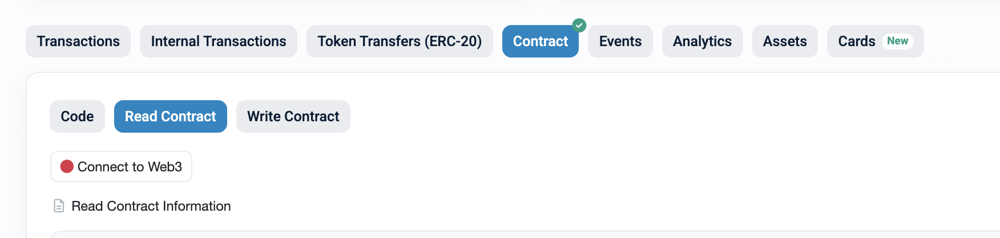
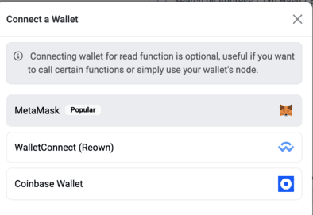
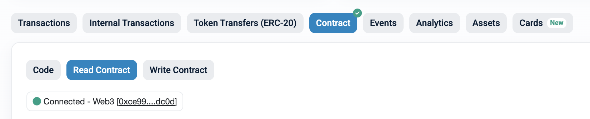
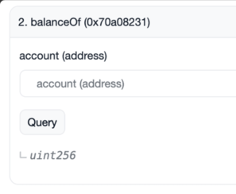
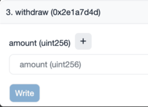

If you participated in the DUSK ERC-20 staking incentive program (ITN2), your DUSK remains safely stored in the ERC-20 staking smart contract. This guide walks you through the steps required to withdraw it manually using Etherscan.

:::note[Note]
This **only** applies to users who staked their DUSK using the ERC-20 staking portal for the ITN2 incentive program (which happened before Dusk mainnet launch).
::: 

---

### Step 1 – Open the staking contract on Etherscan

First, visit the staking contract page on Etherscan:

👉 [0x4ab6ffa52460979dde1e442fb95f8bac56c3adc3 on Etherscan](https://etherscan.io/address/0x4ab6ffa52460979dde1e442fb95f8bac56c3adc3#readContract)

Then, navigate to the **"Contract"** tab:

---

### Step 2 – Connect your Web3 wallet

Click on **“Connect to Web3”**, and approve the connection using the same Ethereum address you used to stake your DUSK.
You will need to confirm the connection on the required wallet pop-ups.

---

### Step 3 – Check your staked balance

Once you ensure that your wallet is now connected:

You can then look at the **"Read Contract"** section, and then find the [function called `balanceOf`](https://etherscan.io/address/0x4ab6ffa52460979dde1e442fb95f8bac56c3adc3#readContract#F2).

You can then enter your Ethereum address and click **Query**, as this returns the exact number of DUSK tokens currently staked for that address:

---

### Step 4 – Withdraw your staked DUSK

1. Switch to the **“Write Contract”** tab.
2. Find the [function called `withdraw`](https://etherscan.io/address/0x4ab6ffa52460979dde1e442fb95f8bac56c3adc3#writeContract#F3).
3. Enter the **exact amount** shown by `balanceOf`.
4. Submit the transaction and confirm it in your wallet.

---

### Contract details

- **ERC-20 Token Address:**  
  [0x940a2db1b7008b6c776d4faaca729d6d4a4aa551](https://etherscan.io/token/0x940a2db1b7008b6c776d4faaca729d6d4a4aa551)

- **Staking Contract Address:**  
  [0x4ab6ffa52460979dde1e442fb95f8bac56c3adc3](https://etherscan.io/address/0x4ab6ffa52460979dde1e442fb95f8bac56c3adc3)

---

If you have questions or need help recovering your staked DUSK, you can contact us on [Discord](https://dusk.network/discord).
