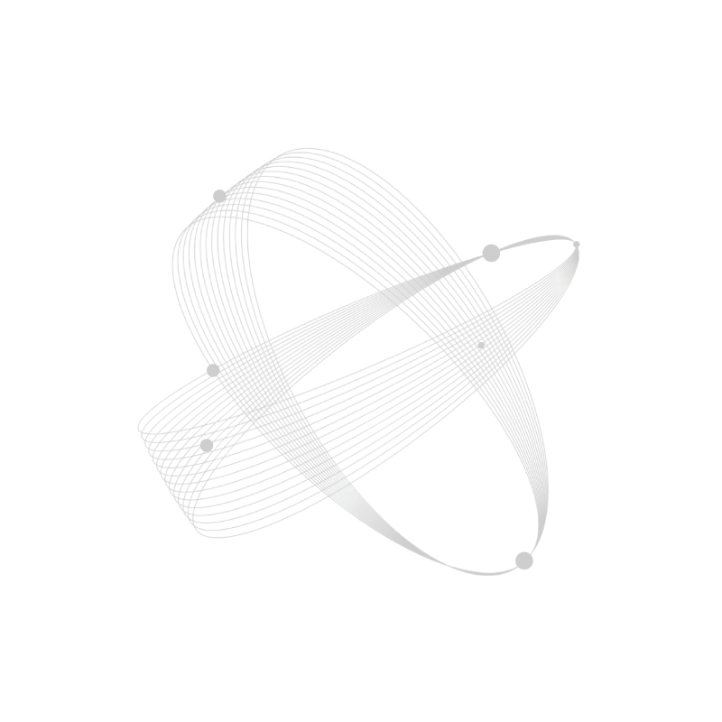
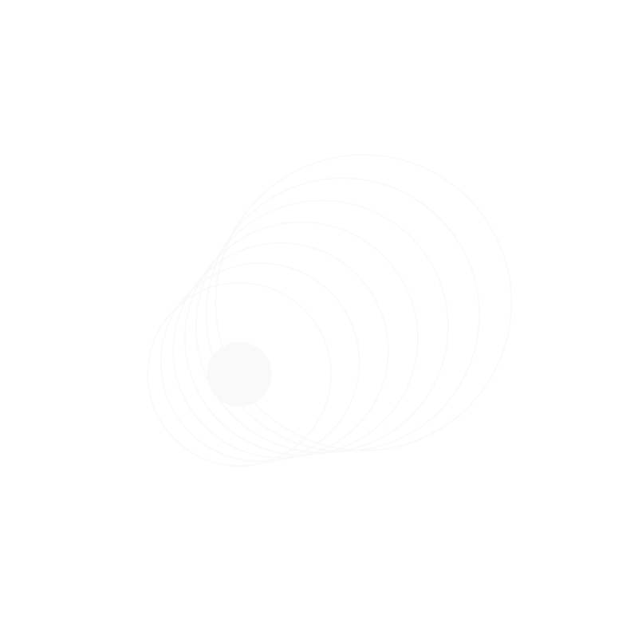
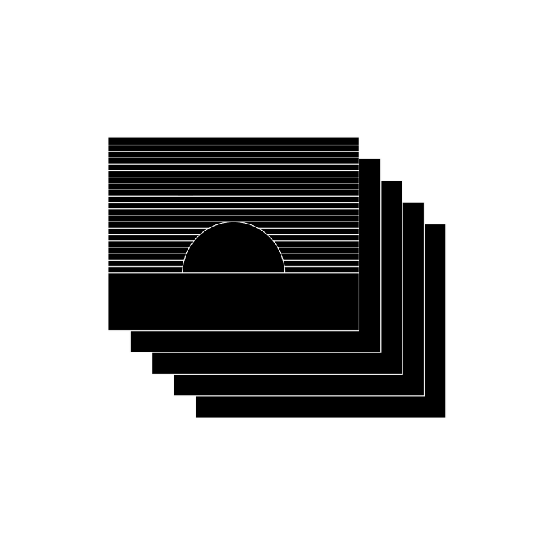
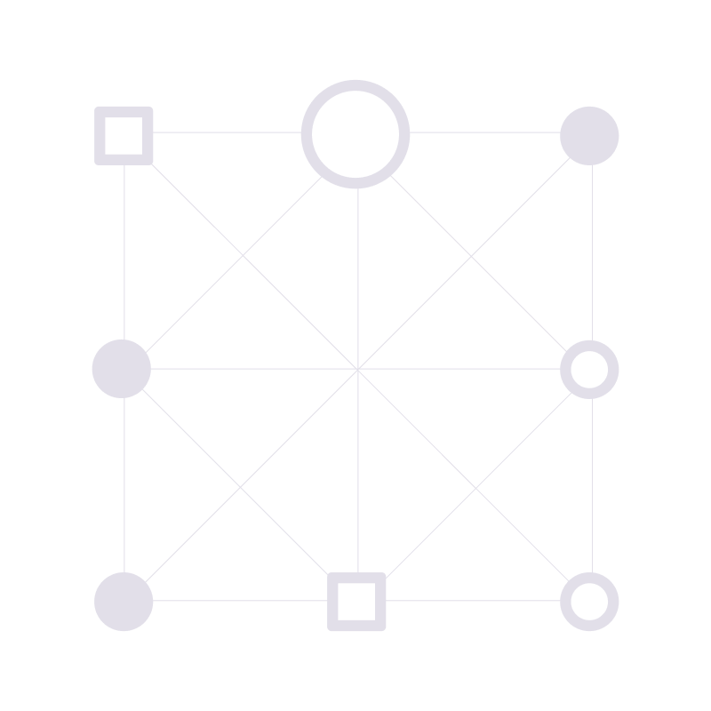
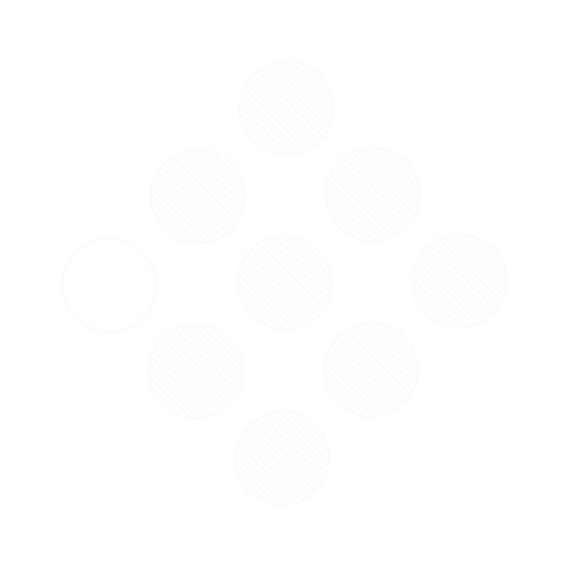
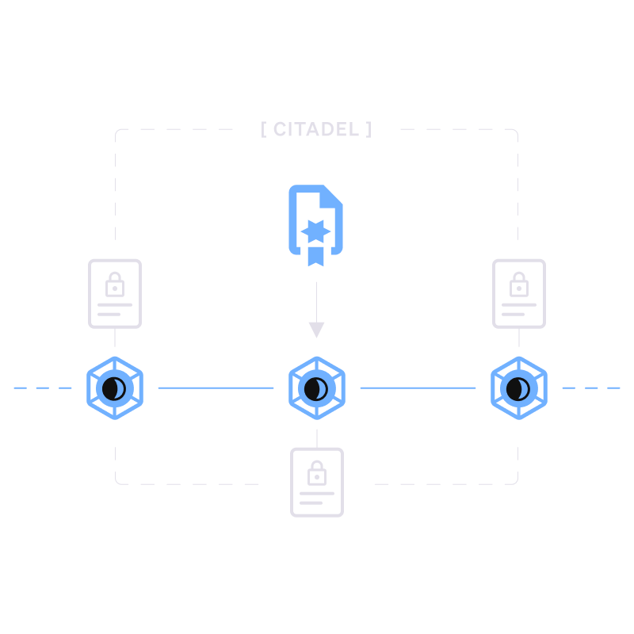

import { LinkCard, Card, CardGrid } from '@astrojs/starlight/components';

Welcome, Duskneer! This guide was created to help you navigate the world of Dusk with ease—let’s get started!

## What is Dusk?

Dusk is a Layer-1 blockchain built to reshape the financial landscape with a focus on privacy, compliance, and decentralization. It empowers secure, on-chain issuance and trading of financial assets like bonds, stocks, and other regulated instruments, providing a reliable and compliant infrastructure for modern finance.

Dusk bridges the gap between traditional finance and blockchain by enabling:
- [Native Issuance](/learn/tokenization-comparison): Assets on Dusk exist entirely on-chain instead of being tokenized versions of off-chain assets. This removes intermediaries, cuts costs, and enables instant settlements.
- [Institutional-Grade Privacy & Compliance](/learn/tokenization-comparison#meeting-institutional-standards):  By leveraging zero-knowledge proofs, transactions remain private while complying with regulatory standards, addressing the concerns of institutions.
- [High Performance & Finality](/learn/introduction/#high-performance-and-finality): The whole tech stack has been built to achieve near-instant finality, ensuring efficiency even under high transaction loads.

Learn [more about Dusk](/learn/introduction), its [usecases](/learn/introduction#use-cases), or explore the [whitepaper](https://dusk-cms.ams3.digitaloceanspaces.com/Dusk_Whitepaper_2024_4db72f92a1.pdf).

## What can you do on Dusk?

There are several things you can do on Dusk:
- [Stake and accrue rewards](/learn/guides/staking-basics/): DUSK can be staked to secure the network and receive rewards. Staking is easy, and it allows users to participate in consensus and increase the decentralization of the protocol.
- [Issue Regulated Financial Assets](https://dusk.network/contact/): Dusk is designed for financial institutions to issue digital bonds, stocks, and RWAs natively on-chain—without the need for intermediaries like Central Securities Depositories (CSDs).
- [Shielded and Public Transactions](/learn/tx-models/): Dusk offers both shielded and public transactions through Phoenix & Moonlight. Institutions can comply with regulations while keeping sensitive data private.
- [Use Self-Sovereign Identity](/developer/digital-identity/protocol/): Dusk’s Citadel SSI solution enables privacy-first identity verification (useful for KYC/AML), letting users prove their identity without disclosing personal details
- [Build & Deploy Smart Contracts](/developer/smart-contract/introduction/): Dusk’s ZK-friendly virtual machine (Dusk VM) enables confidential, high-performance smart contracts.

## Core Components

This section provides a brief overview of Dusk’s [core components](/learn/core-components), highlighting the key technologies and layers that power our network.

| **Component**            | **Description**                                                                                                                                                                                                                                                                         |                    |
|-------------------------------|-------------------------------------------------------------------------------------------------------------------------------------------------------------------------------------------------------------------------------------------------------------------------------------------|-----------------------------|
| **Rusk**                      | Rusk is the reference implementation of the Dusk protocol in Rust. It manages critical tasks like maintaining the chain state, database, and network, as well as offering external APIs and providing host functions.                                                                                               |     |
| **Succinct Attestation**      | High-speed, near-instant finality consensus for secure transactions. It is committee-based and relies on proof-of-stake for its sybil-resistance.                                                                            |  |
| **Dusk VM**  | Highly-optimized ZK-friendly virtual machine with a WASM runtime. It enables the development and execution of privacy-focused smart contracts.                                                                   |  |
| **Kadcast**    |A peer-to-peer network protocol ensuring fast, efficient data broadcasting. It optimizes message exchanges between nodes by using a structured overlay to direct message flow.                                                                            |  |
| **Phoenix & Moonlight**       | Dusk enables both shielded and public transactions through its dual-model approach, offering unmatched flexibility to achieve both privacy and compliance.                          |  |
| **Citadel**                   | Self-sovereign identity solution for privacy-preserving KYC/AML compliance. It is a protocol designed for authenticating with third party services while protecting sensitive data                                     |  |

Find more details about Dusk’s core components [here](/learn/core-components).
---

<CardGrid>
        <LinkCard title="Join the Community" href="https://discord.gg/dusk-official" description="Writing smart contracts for Dusk"/>
        <LinkCard title="Stake DUSK" href="/learn/guides/staking-basics/" description="Earn rewards while securing the network."/>
        <LinkCard title="Are you a developer?" href="/developer/smart-contract/introduction" description="Learn how to start building here"/>
</CardGrid>
