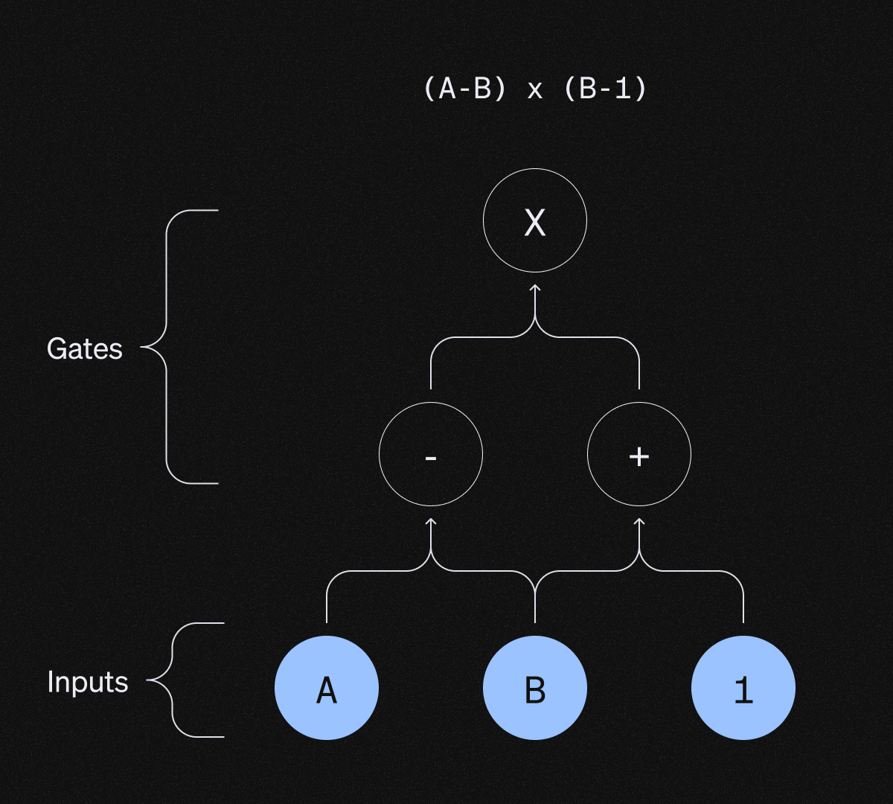

## Introduction

Zero Knowledge Proofs (ZKPs) are cryptographic techniques that allow a prover to convince a verifier that a given statement is true without revealing any additional information.

ZKPs represent a significant advancement in the field of cryptography and privacy-preserving computation, as they expand the range of problems that can be solved and the methods by which they can be approached. ZKPs introduce new mathematical abstractions and tools to reason about information and its manipulation.

Zero Knowledge Proofs allow for more expressive and powerful privacy-preserving protocols, as the primary focus is on the relationships and transformations between different pieces of information, rather than the specific values themselves.

ZKPs offer a unique computing paradigm that focuses on privacy-preserving computation, allowing for the verification of computations without revealing the underlying data or the specifics of the computation itself.

ZKPs can also be viewed as a form of knowledge-compression technology, as by leveraging SNARKs they allow for a succinct proof size and reduced communication overhead.

ZKPs can be also used as a means of verifiable computation, as they enable the prover to prove the correctness of the computation without revealing any information about the computation’s input, output, or internal detail.

To understand how a ZKP works, it is useful to know some basic concepts:

- **Statement**: A claim or assertion that the prover wants to prove to a verifier. A statement is publicly known information.
- **Witness**: a secret that the prover possesses that is used to prove the statement. The witness is the necessary element for the Prover to generate a valid proof. In a ZK setup, the Prover wants to prove to the - Verifier that he knows the witness, without showing it.
- **Prover**: The party trying to prove the statement is true, without revealing the witness.
- **Verifier**: The party verifying the statement’s truth without learning the witness.

## SNARKs
Zero Knowledge Proofs are usually built using a Succinct Non-Interactive Argument of Knowledge (SNARK). The reason is that a SNARKs provides a succinct proof (short and fast to verify). By using SNARKs and adding Zero Knowledge proprieties, we obtain efficient zk-SNARKs.

The proprieties of a SNARK are:

- **Completeness**: An honest Prover always will convince the verifier.
- **Soundness**: if the prover lies, the verifier will reject the answer with a high probability.
- **Succinctness**: proof is short, and verifying time is fast.
- If the SNARK is also zero-knowledge, the verifier does not learn anything about the message itself.

## Arithmetic Circuits

Once we have the computation trace of the statement we want to prove, we can arithmetic circuits to translate that computation into algebraic equations.

An arithmetic circuit is a mathematical model that can represent a computer program via relations between polynomials. Using math, we can leverage the propriety of polynomials to prove statements.

In order to construct a SNARK, the computation to be proven needs to be translated into an arithmetic circuit. By doing so, it is possible to perform very specific arithmetic operations (such as additions and multiplications over the finite field). 

An arithmetic circuit takes as inputs some elements in the finite field and produces an element of the field as output. It is important to notice that the bigger is the computation that needs to be proven, the bigger the number of gates that are needed in the circuit. More specifically, the circuit is constrained to have a maximum number of gates equal to the degree of the polynomial.

An arithmetic circuit can resemble a Directed Acyclic Graph (DAG), where Internal nodes are gates that represent an arithmetic operation (x,+,-,:), and inputs are the variables.

## How to construct a zk-SNARK

The state-of-art when it comes to constructing SNARKs, boils down to:

- Representing the computer program via an arithmetic circuit, by using addition and multiplication gates. This transformation allows to represent the computation in the form of algebraic relations. The reason why this is important is that when working with elliptic curves (or other cryptographic primitives) complex algebraic expressions can be efficiently verified (in contrast to the operations of a computer program's bytecode).
- Converting the circuit description obtained from the arithmetization step into a polynomial identity. In other words, using the arithmetization to obtain a bunch of equations that prove properties of polynomials. By doing so, multiple instances of the arithmetic gates can be succinctly represented via polynomials (therefore enabling succinct commitments to them). One important thing to notice is that the more complex the program is, the higher is the degree of the correspondent polynomials. 
- Committing to the polynomial representation using a Polynomial Commitment Scheme. Different PCS come with different tradeoffs, properties and cryptographic assumptions. It is usually preferrableusing commitment schemes with a constant proof size (that doesn’t depend on the size of the circuit).
- Evaluating the polynomial identity at a random point, several times. If a polynomial identity holds at a random point, it is almost guaranteed to hold at every other point (Schwartz–Zippel lemma). Being able to verify these polynomial relationships by only looking at a single point of evaluation is the reason why we can do it so efficiently.

The above allows for the following flow:

- A prover wants to convince a verifier that they have correctly performed a computation on secret input data.
- The prover creates a zero-knowledge proof demonstrating the correctness of the computation while keeping the input data secret.
- The verifier checks the proof to confirm the correctness of the computation without learning any information about the input data.
- The prover successfully conviced the verifier that the statement is true without revealing the secret witness.
Because of the above steps, what happens in practice is the following:

Which more specifically consists in:

- The prover encodes the witness by using a Polynomial Commitment Scheme, which is a cryptographic tool that allows the prover to commit to a polynomial.
- The prover and verifier engage in an Interactive Oracle Proof (IOP), by interacting via oracle queries. During this interactive stage, the verifier queries the oracle at specific points to check the consistency of the witness with the statement.
- The interactive proof is transformed into a non-interactive one by using the Fiat-Shamir heuristic. This is achieved by replacing the verifier’s random challenges with a deterministic hash function. The prover is then able to generate the non-interactive proof combining the PCS and IOP.
- The prover sends the non-interactive proof to the verifier, who can now efficiently verify the proof without any further interaction with the prover.
- The verifier checks the proof and, if it’s valid, becomes convinced that the statement is true without learning any additional information about the witness.
