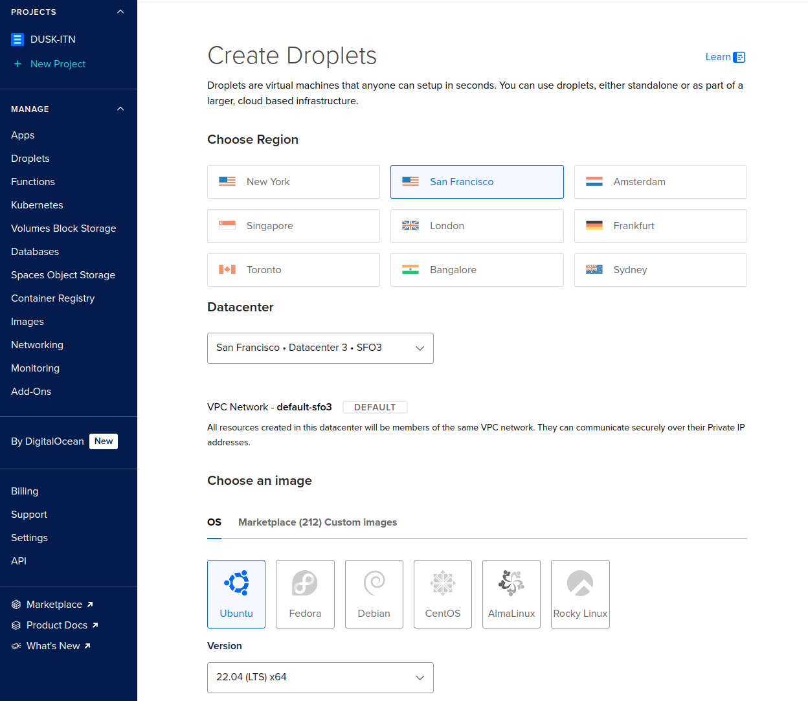
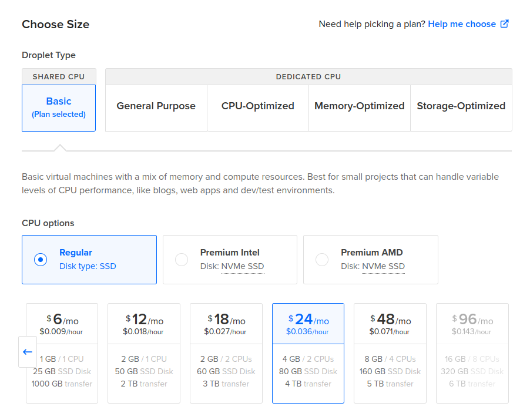
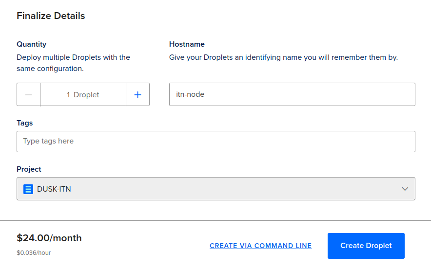
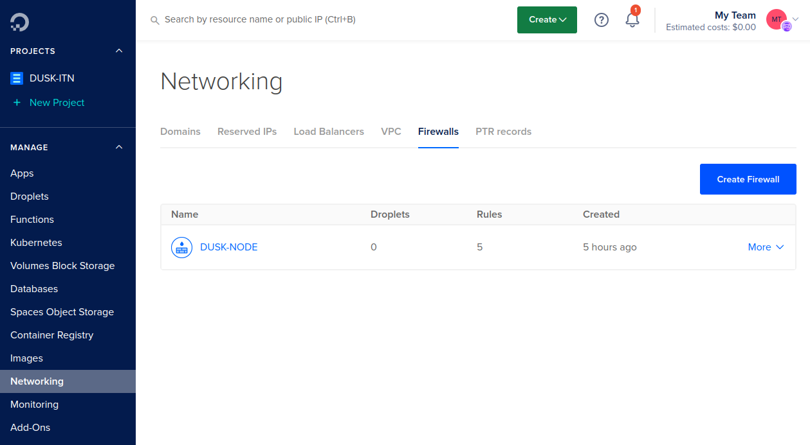
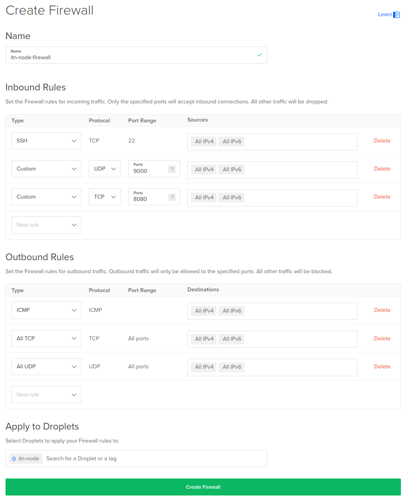
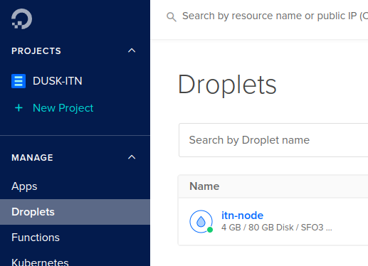
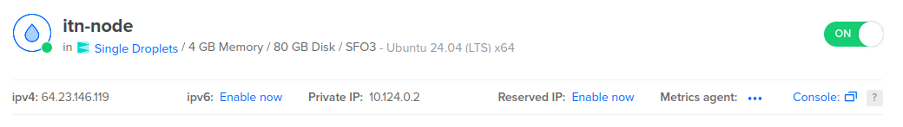
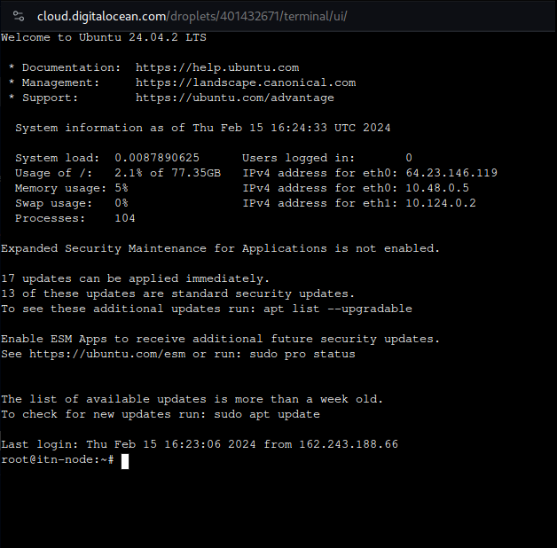

In this guide, we’ll be using [DigitalOcean](https://www.digitalocean.com/) (DO) as our go-to [Virtual Private Server](https://en.wikipedia.org/wiki/Virtual_private_server) (VPS) service. The same can be replicated on Vultr, AWS, any other cloud service or for node runners at home. While it is indeed possible to run a node on home infrastructure, this guide will not deal with those types of setups.

We work under the assumption that you’ve already created an account for your respective service, and provided it with a payment method. If not, you can get a $200 credit by using [our referral link](https://m.do.co/c/9ae612e34de9).

## Create a droplet

DO uses droplets, which are Linux-based virtual machines. When you’re [logged in](https://cloud.digitalocean.com/login) and have set up a default project, navigate to _Droplets_ under the _Manage_ section of your project, and click on [_Create Droplet_](https://cloud.digitalocean.com/droplets/new).


On the _Create Droplets_ page, select any of the provided regions under the _Choose Region_ header. Choosing different regions is good for decentralization and resilience.

Under _Choose an image_, pick Ubuntu version 24.04 (LTS) x64.



Next, we have to pick the size of the droplet. The [node requirements](/operator/02-provisioner#provisioner-specifications) for a provisioner node are in line with the _SHARED CPU_ -> _Regular_ -> $24/mo option. Select it.



Choose an authentication method to access your droplet. Using a SSH key is more secure, but you can also use a password if you prefer. We recommend the SSH key approach. You can follow DOs instructions here: [How to Add SSH Keys to New or Existing Droplets](https://docs.digitalocean.com/products/droplets/how-to/add-ssh-keys/)


That's it for creating your droplet! Give it a hostname, and click on _Create Droplet_:



DO will now set the droplet up for you. This can take a minute:


## Configure Firewall

The Rusk node makes use of the Kadcast protocol to communicate messages between nodes on the network. This protocol uses UDP, and runs on a custom port. Due to the nature of how UDP works, Kadcast is not automatically port forwarded. Regardless of where the node is hosted, it is important that this is done.

Depending on the cloud provider, we need to either add a firewall rule on the instance you’re running, or add a firewall group. If you’re running a local setup, you will need to enable port forward in your router.

DO works with firewall groups. Navigate to _Networking_ -> _Firewalls_ under the _Manage_ section of your project. Click on the [_Create Firewall_](https://cloud.digitalocean.com/networking/firewalls) button.



Give the firewall a name, open UDP under port 9000 and TCP under 8080. Leave all the Outbound rules as they are.

Apply the rules to the nocturne-node droplet you made.

Your firewall should look as follows:



Click on _Create Firewall_ to apply this firewall to your node's droplet.

## Install Rusk

Navigate back to your [droplets overview](https://cloud.digitalocean.com/droplets) and select your Nocturne droplet:



You can connect to your node through SSH on your local machine, or simply click on _Console_ on your droplets page:



A terminal should pop-up and connect you to your Droplet



Just like last time, we've created an easy to use [node installer](https://github.com/dusk-network/node-installer). This installer will set up Rusk as a service on your droplet, preconfigure parts of the node, and provide a couple of helper scripts.

Install Rusk by pasting the following command in your droplet terminal:
```sh
curl --proto '=https' --tlsv1.2 -sSfL https://github.com/dusk-network/node-installer/releases/latest/download/node-installer.sh | sudo sh
```

## Configure Rusk

Once everything has been set up, you will be asked to add your consensus keys. These keys are used to sign and vote for blocks.

If you haven't made a wallet yet, use our CLI [Rusk Wallet](https://wallet.dusk.network/setup/), which you can download [here](https://github.com/dusk-network/rusk/actions/runs/11113602682/artifacts/1997624810), and create a new wallet. You can request funds from our [Discord faucet](/operator/guides/01-nocturne-node#faucet). The faucet will give you 5000 nDUSK. The minimum to stake is 1000 nDUSK.

Once you have access to a Dusk mnemonic, run the following command:
```sh
rusk-wallet restore
```

If your node is not running, it will tell you `some operations won't be available`. This is fine, and happens due to your node not being online yet. You can still continue to follow the steps below.

You will be asked to provide your recovery phrase/mnemonic, **in lowercase**, and to enter a password for the wallet.

Once you've done so, run the following command to export a consensus key for the given wallet:
```sh
rusk-wallet export -d /opt/dusk/conf -n consensus.keys
```

You will be asked to set an encryption password for the consensus key. Remember it and run the following script to set it as an environment variable:
```sh
sh /opt/dusk/bin/setup_consensus_pwd.sh
```

If you've configured everything correctly, you can now start rusk:
```sh
service rusk start
```

Your node will now start syncing. You can check if it indeed is by running:
```sh
ruskquery block-height
```

It is best to wait until your node is synced up. You can find the latest block height on [the block explorer](https://explorer.dusk.network/).

## Stake nDUSK

The final step is to stake. You can stake by running:
```sh
rusk-wallet stake --amt 1000 # Or however much you want to stake
```

Once the transaction has gone through, you can view your staking information by running:
```sh
rusk-wallet stake-info
```

To see if your node is participating in consensus and creating blocks, occasionally check:
```sh
grep "execute_state_transition" /var/log/rusk.log | tail -n 5
```

Note that this can take a while, given that your stake needs at least 2 epochs, or 4320 blocks, to mature. Your stake, relative to the total stake, also plays a factor.

If everything went right, and your node starts accepting and creating blocks, you have successfully set up your Nocturne node!


## Faucet

This guide will explain how to obtain nDUSK for the running Nocturne testnet.

## How to get testnet tokens

The Dusk Nocturne testnet uses a Discord bot to distribute Nocturne tokens (nDUSK).

In order to access it, follow these steps:

1. Access the [Dusk Discord server](https://discord.gg/dusk-official).
2. Among the team members, locate the bot "Dusk Testnet Faucet."
3. Right-click and select "Message".
4. Send `!dusk` as a command. The bot will reply, asking for your Testnet wallet address.
5. Done! Your transaction will be queued, and you will see it in your wallet once processed.

There is currently a limit of 1 transaction per user/wallet every 24 hours.

## FAQ

**Q: How many times can I use the faucet?**

There is currently a 24-hour cooldown period before you can ask for nDUSK again with the same Discord username or wallet address.

**Q: How do I access the Dusk Discord server?**

You can access the Discord server by clicking on [this link](https://discord.gg/dusk-official).

**Q: How long before I will see my nDUSK?**

Once the transaction is submitted, it will be processed in a queue.
The time required to see the nDUSK in your account may vary according to network congestion and the number of people currently requesting nDUSK, but it usually takes just a few minutes.
If the network is experiencing a large number of faucet requests, the transaction might take longer than usual to be processed.

**Q: What if I want to run multiple nodes?**

If you need nDUSK for multiple accounts, you can either wait 24 hours and then send again to the other wallet, or send your nDUSK to the first wallet, and then transfer some of it to the second wallet yourself.

**Q: I got error X, what should I do?**

If you encounter an error with the Discord faucet, please get in touch in our Telegram or Discord channel.
