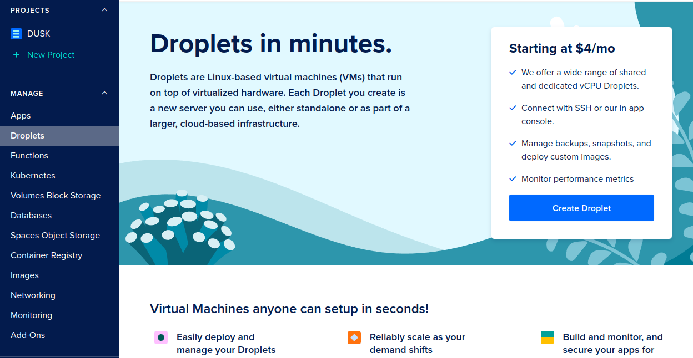
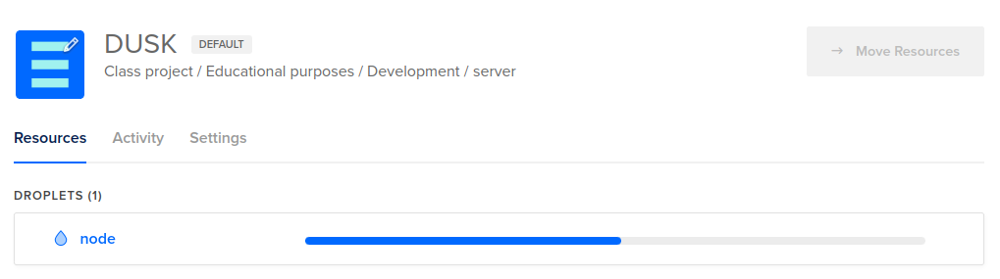
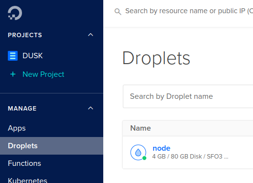
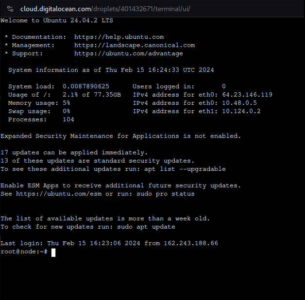

The following instructions are for the upcoming Mainnet dry-runs for December 29th 2024 and January 3rd 2025. The instructions are very similar to the Nocturne guide, with two notable exceptions:
- The node installer now defaults to the mainnet configuration.
- If you participated in the Onramp process, be sure to use that specific wallet when participating.

In this guide, we’ll be using [DigitalOcean](https://www.digitalocean.com/) (DO) as our go-to [Virtual Private Server](https://en.wikipedia.org/wiki/Virtual_private_server) (VPS) service. The same can be replicated on Vultr, AWS, any other cloud service or for node runners at home. While it is indeed possible to run a node on home infrastructure, this guide will not deal with those types of setups.

We work under the assumption that you’ve already created an account for your respective service, and provided it with a payment method. If not, you can get a $200 credit by using [our referral link](https://m.do.co/c/9ae612e34de9).

## Create a droplet

DO uses droplets, which are Linux-based virtual machines. When you’re [logged in](https://cloud.digitalocean.com/login) and have set up a default project, navigate to _Droplets_ under the _Manage_ section of your project, and click on [_Create Droplet_](https://cloud.digitalocean.com/droplets/new).



On the _Create Droplets_ page, select any of the provided regions under the _Choose Region_ header. Choosing different regions is good for decentralization and resilience.

Under _Choose an image_, pick Ubuntu version 24.04 (LTS) x64.


Next, we have to pick the size of the droplet. The [node requirements](/operator/provisioner#provisioner-specifications) for a provisioner node are in line with the _SHARED CPU_ -> _Regular_ -> $24/mo option. Select it.


Choose an authentication method to access your droplet. Using a SSH key is more secure, but you can also use a password if you prefer. We recommend the SSH key approach. You can follow DOs instructions here: [How to Add SSH Keys to New or Existing Droplets](https://docs.digitalocean.com/products/droplets/how-to/add-ssh-keys/)


That's it for creating your droplet! Give it a hostname, and click on _Create Droplet_:


DO will now set the droplet up for you. This can take a minute:



## Configure Firewall

The Rusk node makes use of the Kadcast protocol to communicate messages between nodes on the network. This protocol uses UDP, and runs on a custom port. Due to the nature of how UDP works, Kadcast is not automatically port forwarded. Regardless of where the node is hosted, it is important that this is done.

Depending on the cloud provider, we need to either add a firewall rule on the instance you’re running, or add a firewall group. If you’re running a local setup, you will need to enable port forward in your router.

DO works with firewall groups. Navigate to _Networking_ -> _Firewalls_ under the _Manage_ section of your project. Click on the [_Create Firewall_](https://cloud.digitalocean.com/networking/firewalls) button.


Give the firewall a name, open UDP under port 9000 and TCP under 8080. Leave all the Outbound rules as they are.

Apply the rules to the Mainnet-node droplet you made.

Your firewall should look as follows:


Click on _Create Firewall_ to apply this firewall to your node's droplet.

## Install Rusk

Navigate back to your [droplets overview](https://cloud.digitalocean.com/droplets) and select your Mainnet droplet:



You can connect to your node through SSH on your local machine, or simply click on _Console_ on your droplets page:


A terminal should pop-up and connect you to your Droplet



We've created an easy to use [node installer](https://github.com/dusk-network/node-installer). This installer will set up Rusk as a service on your droplet, preconfigure parts of the node, and provide a couple of helper scripts.

Install Rusk by pasting the following command in your droplet terminal:
```sh
curl --proto '=https' --tlsv1.2 -sSfL https://github.com/dusk-network/node-installer/releases/latest/download/node-installer.sh | sudo bash
```

## Configure Rusk

You now should have successfully installed Rusk.

A quick check with:

```sh
ruskquery version
```

Should tell you, that you are running the latest installer version.

:::tip[Continue with wallet]
Now that you have setup rusk, it's time to setup your wallet to finally start participating in consensus

You can read the [node wallet guide](/operator/guides/node-wallet-setup) for a step-by-step instruction how to set it up on the server.
:::
