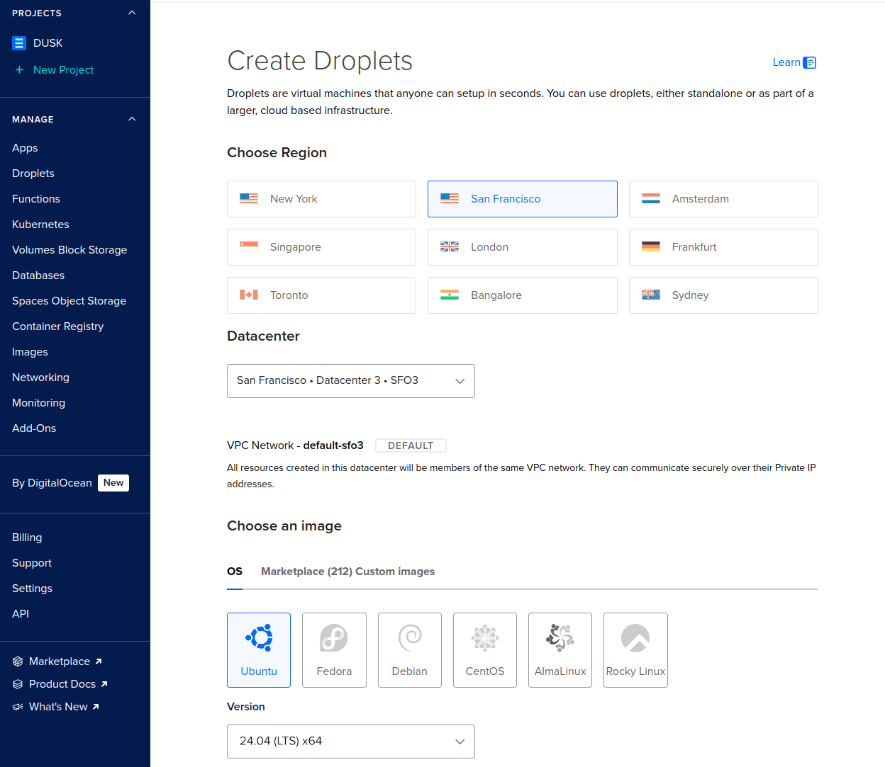
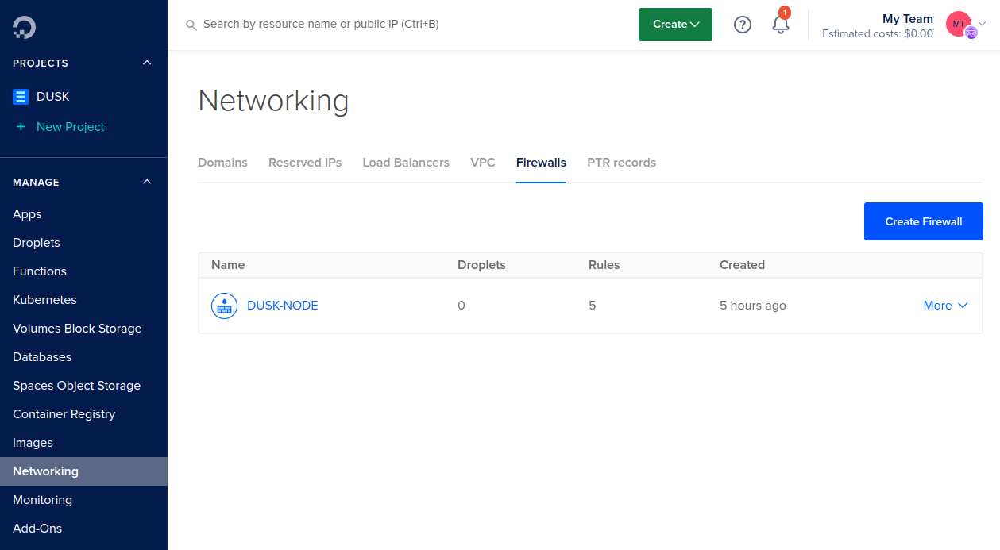
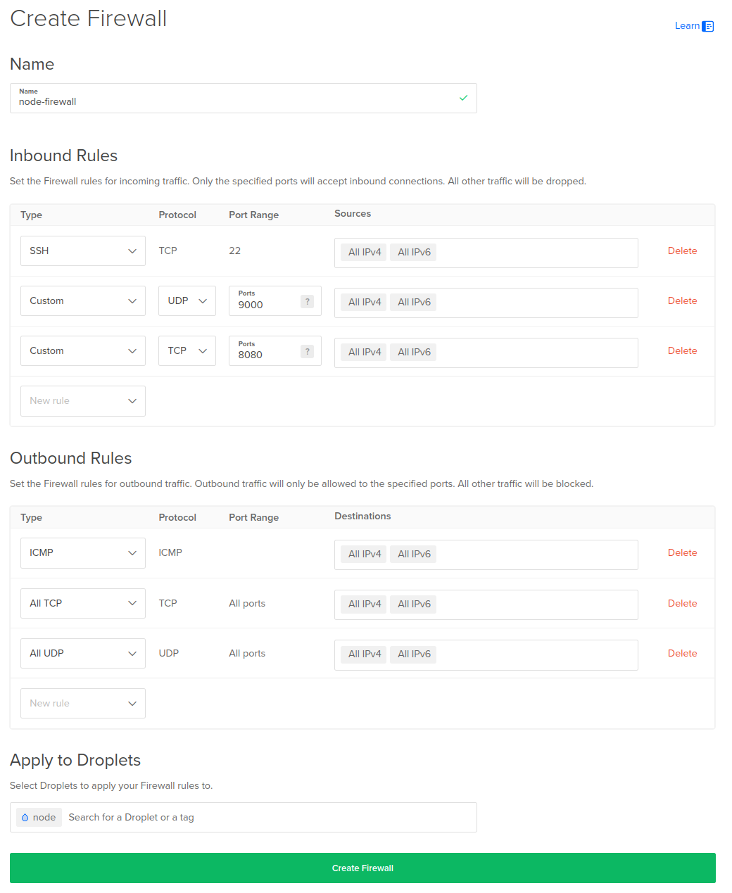
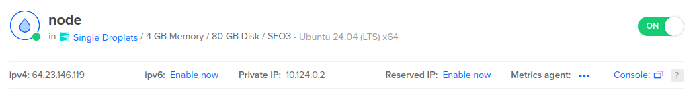

In this guide, we’ll be using [DigitalOcean](https://www.digitalocean.com/) (DO) as our go-to [Virtual Private Server](https://en.wikipedia.org/wiki/Virtual_private_server) (VPS) service. The same can be replicated on Vultr, AWS, Hetzner, or any other cloud service or for node runners at home. While it is indeed possible to run a node on home infrastructure, this guide will not deal with those types of setups.

We work under the assumption that you’ve already created an account for your respective service, and provided it with a payment method. If not, you can get a $200 credit by using [our referral link](https://m.do.co/c/9ae612e34de9).

## Create a droplet

DO uses droplets, which are Linux-based virtual machines. When you’re [logged in](https://cloud.digitalocean.com/login) and have set up a default project, navigate to _Droplets_ under the _Manage_ section of your project, and click on [_Create Droplet_](https://cloud.digitalocean.com/droplets/new).


On the _Create Droplets_ page, select any of the provided regions under the _Choose Region_ header. Choosing different regions is good for decentralization and resilience.

Under _Choose an image_, pick Ubuntu version 24.04 (LTS) x64.



Next, we have to pick the size of the droplet. The [node requirements](/operator/provisioner#provisioner-specifications) for a provisioner node are in line with the _SHARED CPU_ -> _Regular_ -> $24/mo option. Select it.


Choose an authentication method to access your droplet. Using a SSH key is more secure, but you can also use a password if you prefer. We recommend the SSH key approach. You can follow DOs instructions here: [How to Add SSH Keys to New or Existing Droplets](https://docs.digitalocean.com/products/droplets/how-to/add-ssh-keys/)


That's it for creating your droplet! Give it a hostname, and click on _Create Droplet_:


DO will now set the droplet up for you. This can take a minute:


## Configure Firewall

The Rusk node uses the Kadcast protocol to communicate messages between nodes on the network. This protocol uses UDP and requires custom port forwarding. Depending on your hosting provider or local setup, you'll need to enable the following ports:
- **SSH port**: Default is `22` for remote access
- `9000/udp`: For Kadcast (used for consensus messages)
- (Optional) `8080/tcp`: For the HTTP server (primarily used for archive nodes)

### Firewall Group

If you're using DO or a similar cloud provider, configure a firewall group. Navigate to _Networking_ -> _Firewalls_ under the _Manage_ section of your project. Click on the [_Create Firewall_](https://cloud.digitalocean.com/networking/firewalls) button.



Give the firewall a name, open UDP under port 9000 (optionally TCP under 8080 too). Leave all the Outbound rules as they are.

Apply the rules to the node droplet you made.

Your firewall should look as follows:



Click on _Create Firewall_ to apply this firewall to your node's droplet.

### Local Firewall

For local setups, you can use tools like `ufw`, `iptables`, or `firewalld`. Although it's not strictly needed to setup a local firewall if you use firewall groups, it's still recommended to do so with "layered security" in mind.

Here's an example setup using `ufw`:
```bash
# Allow SSH (default port 22) with rate limiting
sudo ufw limit ssh
# Allow Kadcast UDP traffic
sudo ufw allow 9000/udp
# Enable the firewall
sudo ufw enable
```

For non-default SSH ports, replace `ssh` with the specific port number. Adjust commands if using other firewall tools.

## Install Rusk

Navigate back to your [droplets overview](https://cloud.digitalocean.com/droplets) and select your droplet:


You can connect to your node through SSH on your local machine, or simply click on _Console_ on your droplets page:



A terminal should pop-up and connect you to your Droplet


### (Optional) User and Group Permissions

Before using the node installer, we recommend setting up a secure, dedicated non-root user account. This is not strictly necessary, but a good security practice. If you haven't created such a user yet, follow these steps:

#### Step 1: Create a Dedicated Group & User

Create a new non-root user (e.g., `duskadmin`), add them to the `dusk` group and set a password for the new user:
```sh
sudo groupadd --system dusk
sudo useradd -m -G dusk -s /bin/bash duskadmin
sudo passwd duskadmin
```

#### Step 2: Set Up SSH Access

Ensure the new user has access to your public SSH keys for secure login. Add your public key directly to the new user's `authorized_keys` file:
1. Edit or create the `authorized_keys` file for the new user:
```sh
mkdir -p /home/duskadmin/.ssh
sudo nano /home/duskadmin/.ssh/authorized_keys
```
2. Paste your public SSH key (e.g., starting with `ssh-rsa` or `ssh-ed25519`)
3. Save and set proper permissions:
```sh
sudo chmod 700 /home/duskadmin/.ssh
sudo chmod 600 /home/duskadmin/.ssh/authorized_keys
sudo chown -R duskadmin:dusk /home/duskadmin/.ssh
```

#### Step 3: Add `duskadmin` to the `sudo` Group

If not already done, log in as `root` or a user with sufficient privileges and add `duskadmin` to the `sudo` group:
```sh
sudo usermod -aG sudo duskadmin
```
Log out from you node for the group changes to take effect.

#### Step 4: Verify Access

Test SSH access to the new user account by connecting to the node with the new account:
```sh
ssh duskadmin@<your-server-ip>
```

### Node Installer

We've created an easy to use [node installer](https://github.com/dusk-network/node-installer). This installer will set up Rusk as a service on your droplet, preconfigure parts of the node, and provide a couple of helper scripts.

Install Rusk by pasting the following command in your droplet terminal:

import { Tabs, TabItem } from '@astrojs/starlight/components';

<Tabs syncKey="network">
   <TabItem label="Mainnet">
    ```sh
    curl --proto '=https' --tlsv1.2 -sSfL https://github.com/dusk-network/node-installer/releases/latest/download/node-installer.sh | sudo bash
    ```
   </TabItem>
   <TabItem label="Testnet">
    ```sh
    curl --proto '=https' --tlsv1.2 -sSfL https://github.com/dusk-network/node-installer/releases/latest/download/node-installer.sh | sudo bash -s testnet
    ```
   </TabItem>
   <TabItem label="Devnet">
    ```sh
    curl --proto '=https' --tlsv1.2 -sSfL https://github.com/dusk-network/node-installer/releases/latest/download/node-installer.sh | sudo bash -s devnet
    ```
   </TabItem>
</Tabs>

### Verify Installation

Once installed, verify the installer version with:

```sh
ruskquery version
```

You should see the latest version number confirming a successful installation.

## Configure Rusk

Now that you have setup rusk, it's time to setup your wallet to finally start participating in consensus

You can read the [node wallet guide](/operator/guides/node-wallet-setup) for a step-by-step instruction how to set it up on the server.
