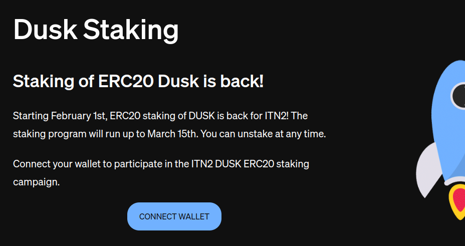
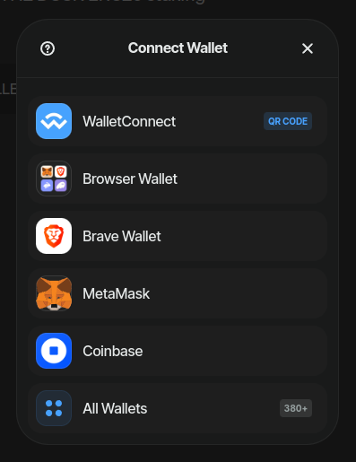
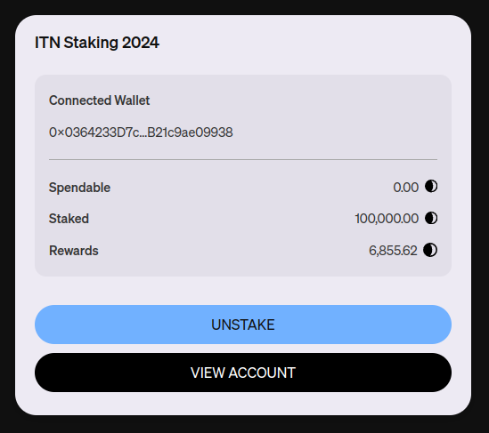

# Quick guide on how to unstake DUSK
## Step 1 - Visit staking.dusk.network
Navigate to [staking.dusk.network](https://staking.dusk.network/). 

## Step 2 - Connect
Click on the `Connect Wallet` button. 

## Step 3 - Select
Select your wallet of choice and accept the request to connect the wallet.

## Step 4 - Unstake
You can retrieve your DUSK at any time by clicking on `Unstake`.

## Frequently Asked Questions (FAQ)

**Q: How do I receive rewards?**

While you are staking you accrue rewards at a rate proportional to your stake. You can unstake and restake as you wish, but rewards only accrue while your DUSK is staked. Rewards are not lost by unstaking.

**Q: When will I get my rewards?**

The rewards will be given to you when you bridge from Ethereum to our mainnet with the same address you staked with. Did you earn a 1000 DUSK during the staking period? Then you'll receive a 1000 DUSK extra when you bridge to mainnet.

**Q: Where can I find the DUSK ERC20 token address and staking contract address?**

The DUSK ERC20 token address is: [0x940a2db1b7008b6c776d4faaca729d6d4a4aa551](https://etherscan.io/token/0x940a2db1b7008b6c776d4faaca729d6d4a4aa551)
The staking contract address is: [0x4ab6ffa52460979dde1e442fb95f8bac56c3adc3](https://etherscan.io/address/0x4ab6ffa52460979dde1e442fb95f8bac56c3adc3)

**Q: Can I withdraw my stake at any time?**

Yes! You can withdraw your stake at any time

**Q: How do I get the DUSK I stake mirrored on ITN as tDUSK?**

If you stake between February 1st and February 14th, do not unstake, and provide an optional Dusk address created through the [web wallet](https://wallet.dusk.network/), you will receive the staked amount in tDUSK.